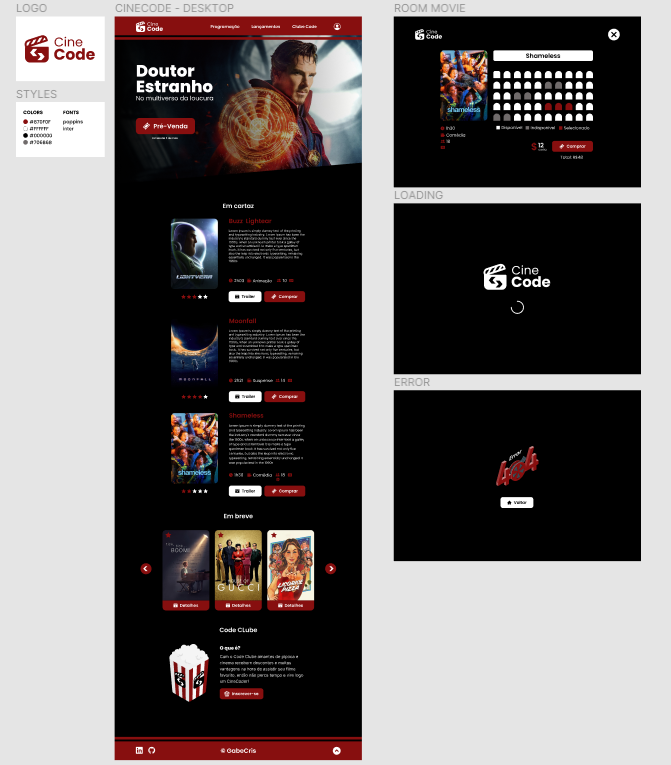

<h2 align="center"> - Cine Code -</h2>

<a href="https://gabecris.github.io/ToDo/" target="_blank">👉 Acesse a página aqui 👈</a>

## - Projeto Cine Code - 
 
Este é meu primeiro projeto feito com REACT!  Se trata de uma página de cinema, em que você visualiza os filmes em cartaz, vê os detalhes, e pode comprar ingressos para assistí-lo, além de poder escolher seu assento na sala da sessão.
 
 

## - Tecnologias utilizadas -
 
<!-- HTML -->
<!-- REACT -->

<b> React</b>
 
 

• API The Movie DataBase

• react-awesome-reveal

• react-router-dom

• react-scroll

• reactjs-popup

• styled-components

 

 <b> HTML 5</b>

 

<!-- CSS -->

 <b> CSS 3</b>

• Modules CSS

 

 

 
<b> Figma</b>
 

 

• Protótipo da interface

• Desenvolvido o design e demais estilos da página

## - Meus contatos -
 

Sinta-se livre para entrar em contato comigo, seja para dar algum feedback do projeto, pedir alguma ajuda ou também apenas conversar um pouco sobre desenvolvimento e tecnologias =D

 

 
  <a href = "mailto:gabrecrisanto@gmail.com" target="_blank">
  
   
   
   
  

